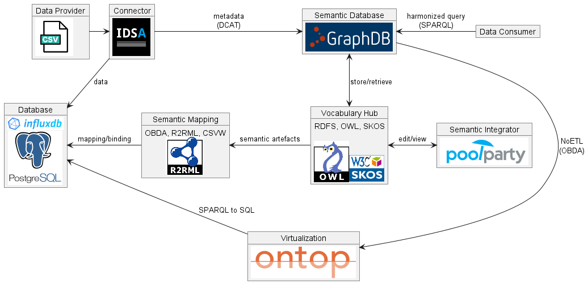

## Raising the Role of Vocabulary Hubs for Semantic Data Interoperability in Dataspaces
Robert David
Petar Ivanov
Vladimir Alexiev

***
### Introduction

- the european data economy depends on the availability of data 
- technological foundation + services and tools to make use of it
- different industries and communities
- machine-learning systems need high-quality training data
    - predictive maintenance

Data space standards, like IDS, provide 
**technical foundation** and **data sovereignty** principles.

***
### Motivation

- interoperability is key for making use of shared data
- syntactic data exchange already solved, I.e. defined data formats and exchange standards
- semantic interoperability still an open challenge
- Starting point: IDS RAM and IM defines semantic metadata
- we need to extend it to cover **semantic interoperability for data**

***
### Approach
- Semantic Interoperability via a **Semantic Layer** for Dataspaces
    - based on IDS Vocabulary Hub
    - based on knowledge graph (KG) technologies
    - implemented by **GraphDB + PoolParty** products
- services + data for semantic interoperability
- data discovery & harmonisation
- semantic metadata + data for discovery and integration

***
### Use Cases
2 running projects:
DataBri-X
- energy community simulation and prediction
- legal knowledge graph + document analysis

UNDERPIN
- refinery predictive maintenance
- wind farms predictive maintenance

***
### Approach

Semantic Layer supports structured and unstructured data interlinked in the KG.
Structured
- Ontology-Based Data Access (OBDA)
- RDB to RDF Mapping Language (R2RML)
- CSV on the Web (CSVW)

Unstructured
- semantic document annotations via KG entities

***

### Approach

Semantic Layer supports inference services.

- reasoning based on W3C recommendations OWL & SHACL
- inference tagging expands semantic annotations in documents
- vocabulary crosswalks connect different similar vocabularies
- metadata inference to determine specific vocabularies for domains

***
### Integration Architecture

***
### Data Consumer Benefits

***
### Conclusions and Future Work
